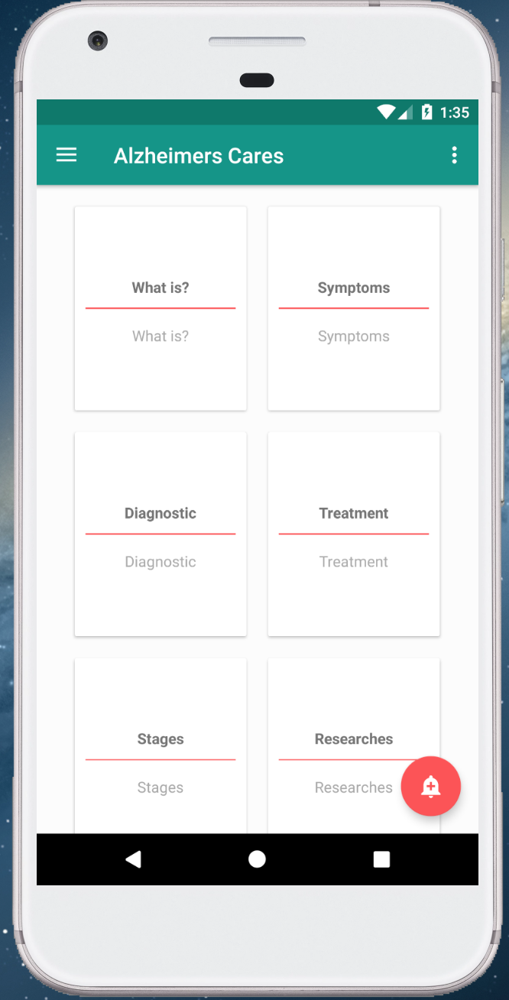
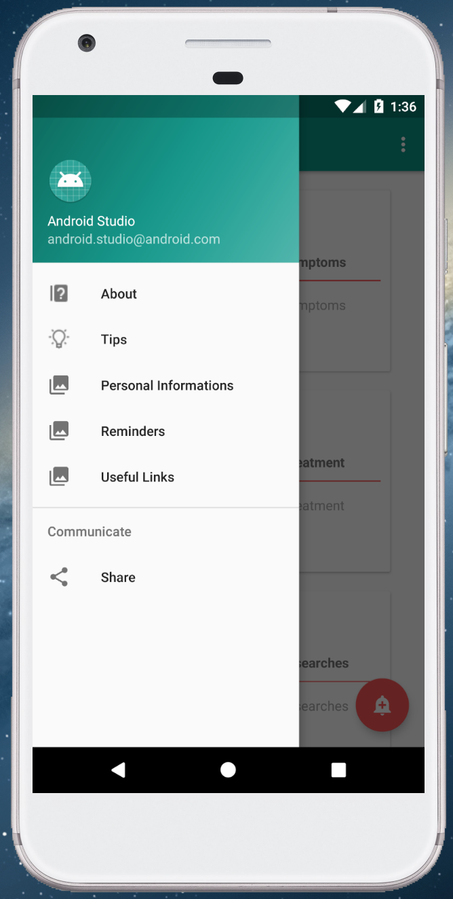
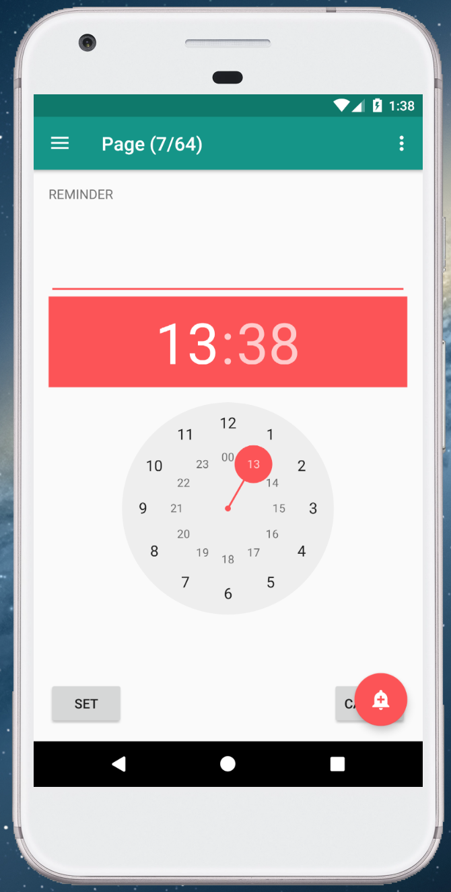
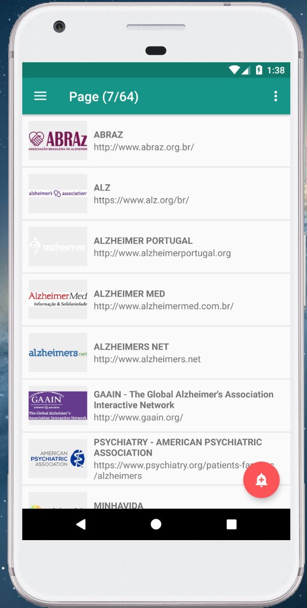
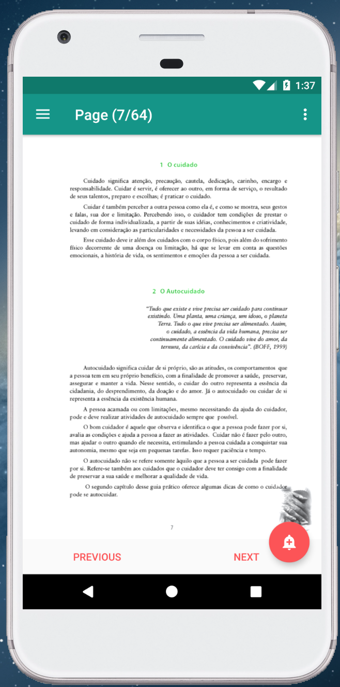
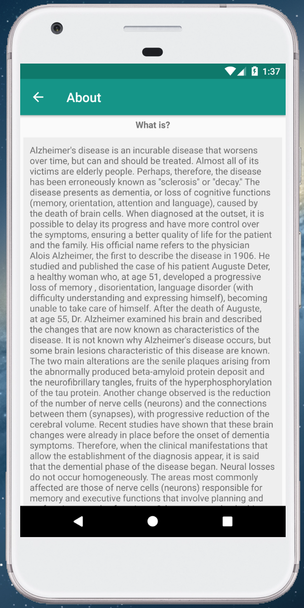

# AlzheimersCares
## Tools
> ( Kotlin + Room + Android Studio )  

## Description
* Application to help caregivers and relatives of people with Alzheimer's, has features to learn more about the disease, useful links, reminders of everyday activities and other functionalities.  

## Target
* Application created in the discipline of mobile projects of the academic master's degree from UFRPE.  

## Screens
### Home Screen
  
### Menu Screen
  
### Reminder Screen
  
### Useful links Screen
  
### Tips Screen
  
### Disease about Screen
  

## How to run
* Run from Android Studio

## Contact
* Rafael.dougllas@gmail.com  

- [Linkedin](https://www.linkedin.com/in/rafael-douglas-093788a6/) 

